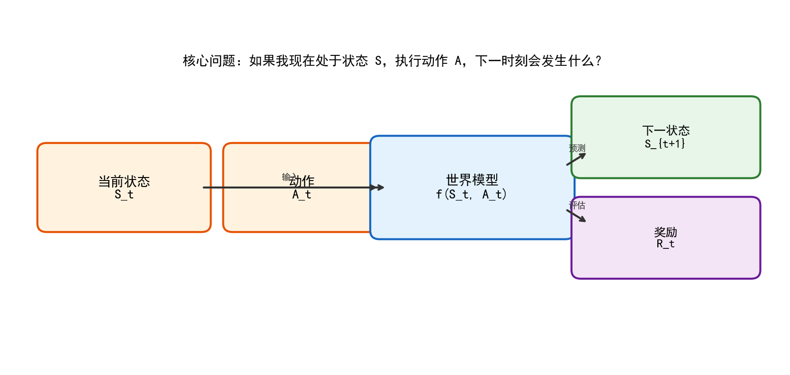
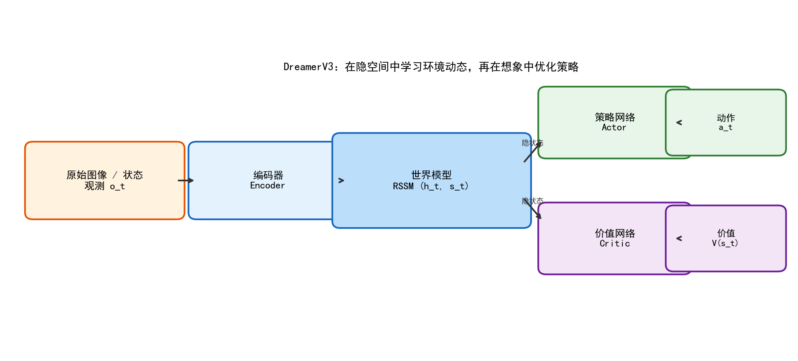
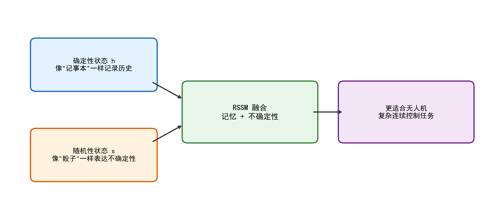
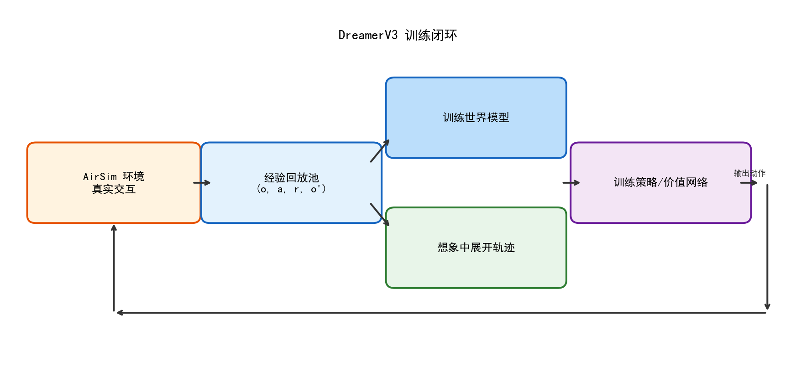
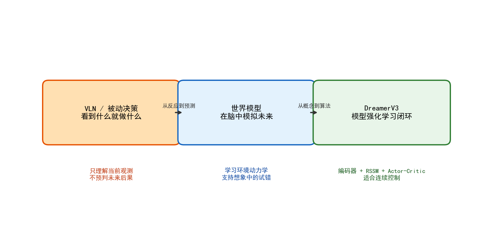
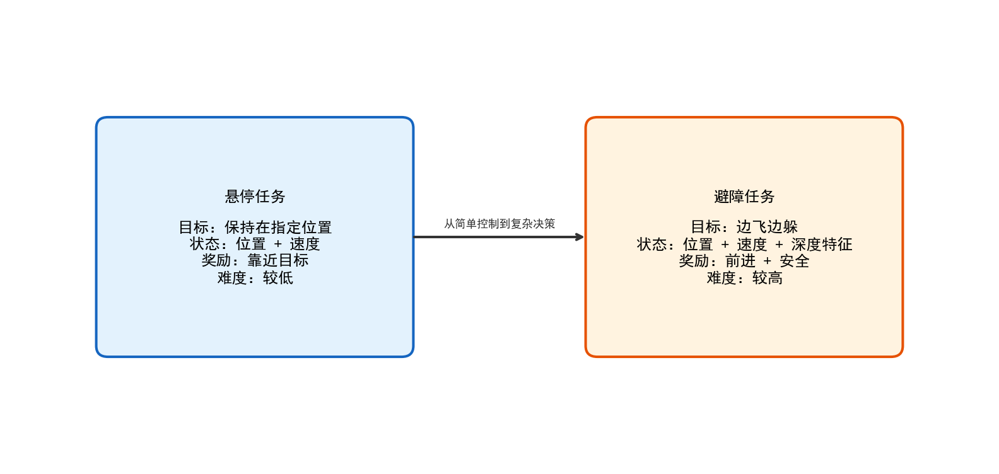
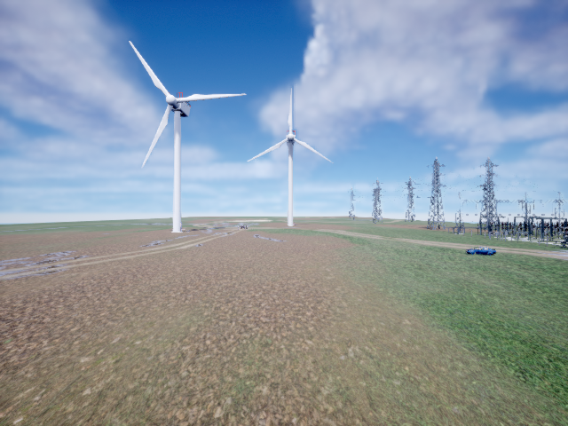

# 第八章 世界模型与无人机应用

## 8.1 从“看见再反应”到“预判未来”

在前面的章节中，我们已经学习了如何让大语言模型（LLM）参与无人机的任务分解、路径规划和多机协同。无论是中心化协同、分布式协同，还是层级式协同，本质上都在解决一个共同问题：**面对复杂环境，智能体如何做出更合理的决策。**

但是，前面几章的方法大多仍然属于“看见什么，就对什么做出反应”的范式。也就是说，系统主要依据**当前时刻**观测到的信息来决定下一步动作。对于很多简单任务，这样的方法已经足够有效；但一旦进入复杂、动态、连续控制的场景，这种“被动反应式”决策就会暴露出明显局限。

以无人机飞行为例：

- 当无人机飞向障碍物时，仅仅根据当前图像做即时反应，可能已经太晚；
- 当无人机需要保持稳定悬停时，仅仅看当前误差还不够，还需要预判接下来几步的位置变化；
- 当无人机在复杂环境中搜索、巡检或避障时，最优动作往往不取决于“眼前这一帧”，而取决于“未来几秒会发生什么”。

这就引出了本章的核心主题——**世界模型（World Model）**。

世界模型的核心思想很朴素：

> 让智能体不仅能“看懂现在”，还能够“在脑中模拟未来”。

如果说传统的感知-控制系统像是一个只会“见招拆招”的新手，那么世界模型就像是一个会“提前想三步”的高手。它能够根据当前状态和候选动作，预测未来会发生什么，再从多个未来中选择更优的那个。

对于高年级工科学生来说，可以把世界模型理解为一个**环境动力学模拟器**，只是这个模拟器不是手工写出来的，而是通过数据学习出来的。它相当于在无人机的控制系统内部，又额外放进去了一个“虚拟世界”，供算法在里面做低成本试错。

---

## 8.2 世界模型到底是什么

### 8.2.1 核心定义

世界模型并不是某一种单一算法，而是一类方法的总称。它的共同目标是学习如下映射关系：

$$S_{t+1}, R_t = f(S_t, A_t)$$

其中：

- $S_t$ 表示当前状态（state）
- $A_t$ 表示当前动作（action）
- $S_{t+1}$ 表示下一时刻状态
- $R_t$ 表示奖励（reward）
- $f$ 就是世界模型本身

通俗地说，这个公式回答的是下面这个问题：

> 如果我现在处在状态 $S_t$，并且执行动作 $A_t$，下一步会发生什么？

在无人机场景中，这个“发生什么”通常至少包括两类信息：

1. **状态如何变化**：位置是否偏移、速度是否变化、姿态是否稳定；
2. **这个动作值不值得**：是让无人机更接近目标了，还是更危险了。

### 8.2.2 以无人机为例理解状态与动作

为了让概念更具体，我们可以把无人机的状态和动作写成更工程化的形式。

#### 状态（State）

一个简化的无人机状态向量可以包括：

- 位置：$x, y, z$
- 速度：$v_x, v_y, v_z$
- 姿态：roll, pitch, yaw
- 传感器信息：图像、深度、IMU 等

在本章的简化实验里，我们首先使用一个 6 维状态向量：

```python
state = [x, y, z, vx, vy, vz]
```

在避障任务中，我们再把深度图的统计特征加入状态，形成 12 维状态：

```python
state = [x, y, z, vx, vy, vz,
         left_mean, center_mean, right_mean,
         left_min, center_min, right_min]
```

这说明一个重要思想：**状态不是固定格式，而是任务相关的。**

#### 动作（Action）

对多旋翼无人机来说，一个简化动作可以表示为：

- pitch：前后倾斜
- roll：左右倾斜
- yaw_rate：偏航角速度
- throttle：油门

在本章的实验里，动作通常写成 4 维连续向量：

```python
action = [pitch, roll, yaw_rate, throttle]
```

这也是为什么 DreamerV3 非常适合无人机控制：**它天然支持连续动作空间**，而无人机控制本来就是连续控制问题。

### 8.2.3 世界模型不是“记忆图像”，而是“学习规律”

很多初学者第一次听到世界模型时，会误以为它就是“把下一帧图像预测出来”。这其实只是表象。

世界模型真正重要的不是“画出一张图”，而是学会环境的运行规律。

举几个直观例子：

- 无人机向左倾斜，画面会向左偏；
- 油门增大，机体会上升；
- 前方障碍物越来越近，再继续前进大概率会碰撞；
- 如果当前速度已经很大，哪怕图像上障碍物还远，也要提前减速。

这些都是**环境动力学规律**。世界模型的价值在于：它不只是看到一个结果，而是抓住了“动作—状态变化—后果”之间的因果结构。

因此，可以把世界模型理解成：

> 一个通过数据学习出来的、可供智能体在脑中反复调用的“虚拟环境”。

---

## 8.3 为什么无人机需要世界模型

### 8.3.1 被动决策的局限

在很多经典视觉导航（VLN）或反应式控制方法中，智能体的逻辑是：

1. 看当前图像；
2. 根据图像输出一个动作；
3. 执行动作；
4. 再看下一帧图像。

这种方法的问题在于，它只利用“当前时刻”的信息，而没有真正建立“未来演化”的概念。

对于无人机，这会带来以下风险：

- **短视**：当前没撞上障碍物，并不代表下一秒不会撞上；
- **样本浪费**：必须真的飞出去、真的试错，才能知道动作好不好；
- **控制不稳定**：连续控制任务中，单步最优动作不一定带来长期最优结果。

### 8.3.2 世界模型的三个核心价值

#### 1. 在“脑中”试错

这可能是世界模型最重要的价值。

如果没有世界模型，智能体只能在真实环境里试错；而有了世界模型后，智能体可以先在内部模拟器中试很多种动作，再选最好的那个去执行。

对于无人机来说，这尤其关键，因为真实试错成本很高：

- 会撞机；
- 会浪费电量；
- 会浪费训练时间；
- 在真实设备上甚至可能损坏硬件。

#### 2. 提高样本效率

模型强化学习（Model-Based RL）通常比无模型强化学习（Model-Free RL）更省数据。

原因很简单：

- 无模型方法每学到一点东西，都要靠真实交互换来；
- 世界模型方法只需少量真实数据来拟合环境，然后就能在“想象世界”里反复训练策略。

对于教学场景而言，这意味着：

- 更适合在有限硬件条件下做实验；
- 更容易在可接受时间内看到结果；
- 更容易帮助学生理解“数据—模型—策略”的完整闭环。

#### 3. 支持连续控制任务

无人机的控制是天然连续的：

- 油门不是“开/关”两种，而是连续变化；
- pitch、roll、yaw_rate 都是连续量；
- 位置和速度也是连续状态。

DreamerV3 这类世界模型方法对连续控制非常友好，因为它不是依赖离散动作枚举，而是直接在连续空间里学习和优化。

---

## 8.4 从无模型强化学习到模型强化学习

### 8.4.1 两类方法的直观对比

下表是最值得先建立的总体认识：

| 对比项 | 无模型强化学习 | 模型强化学习 |
|--------|----------------|--------------|
| 代表算法 | DQN, PPO, A2C | DreamerV3, PlaNet, World Models |
| 核心思路 | 直接学策略 | 先学环境，再学策略 |
| 数据需求 | 高 | 相对低 |
| 训练成本 | 高 | 相对低 |
| 风险 | 真实环境试错多 | 模型偏差 |
| 适合场景 | 数据便宜、环境简单 | 数据昂贵、连续控制、物理系统 |

### 8.4.2 一个生活类比

可以把这两类方法类比成学开车：

- **无模型强化学习**：上来就真开，撞几次、熄火几次，慢慢学会；
- **模型强化学习**：先用驾驶模拟器练，脑中形成规律，再上真车。

当然，模拟器也不一定完全真实——这就引出了世界模型的最大挑战：**模型偏差（Model Bias）**。

### 8.4.3 模型偏差：世界模型最核心的问题

世界模型不是现实本身，而只是现实的近似。如果这个近似不够准，那么智能体在“虚拟世界”里学会的好策略，放到真实环境里可能根本不好用。

这就像：

- 你在一张错误地图上规划出了一条“最短路线”；
- 结果到了现实世界才发现，这条路其实是断的。

在本章后面的悬停训练实验中，我们会亲眼看到这个现象：

- 策略在“想象中”的奖励越来越高；
- 但放到真实 AirSim 里，效果可能还不如随机策略。

这不是实验失败，而是教学上非常宝贵的一课——它让学生真正理解，为什么世界模型的准确性如此重要。

---

## 8.5 隐空间建模：为什么不直接预测像素

### 8.5.1 直接预测图像的问题

假设我们让模型直接预测下一帧 RGB 图像。

如果图像尺寸是 64×64，那么单帧 RGB 图像的维度就是：

$$64 \times 64 \times 3 = 12288$$

这意味着模型每一步都要预测一万多个数值。而且这些数值里，很多都与控制决策关系不大，比如：

- 天空的颜色；
- 地面的纹理；
- 远处风机叶片上的细节；
- 光照和阴影的变化。

因此，直接做像素预测会有三个主要问题：

1. **维度太高**：计算和学习难度都很大；
2. **冗余太多**：大量像素细节不影响决策；
3. **容易受噪声干扰**：压缩噪声、光照变化都可能误导模型。

### 8.5.2 隐空间建模的思想

解决方法是：先把高维观测压缩到一个低维的“隐空间”里，再在隐空间中建模动态。



这个流程可以写成：

```text
高维观测 o_t
   ↓ 编码器 Encoder
低维隐状态 z_t
   ↓ 世界模型 f(z_t, a_t)
预测隐状态 z_{t+1}
   ↓ 解码器 Decoder（可选）
重建观测 / 预测图像
```

本质上，编码器做的是“提纯信息”的工作：

- 去掉不重要的细节；
- 保留对决策真正关键的语义信息；
- 降低建模难度。

### 8.5.3 隐空间对无人机控制的意义

对无人机来说，真正重要的通常不是像素本身，而是如下信息：

- 前方是不是有障碍物；
- 当前离目标有多远；
- 姿态是否稳定；
- 是继续前进更安全，还是应该先减速、转向。

这些高层语义信息完全可以压缩到几十维甚至更低的向量中。世界模型在这个向量空间中学习环境动态，会比直接预测像素高效得多。

---

## 8.6 DreamerV3：世界模型中的代表方法

DreamerV3 是当前最有代表性的世界模型方法之一。它特别适合机器人和无人机这类连续控制任务，因此本章选用它作为教学主线。

### 8.6.1 DreamerV3 的整体结构

DreamerV3 可以分为四个主要组件：

1. **编码器（Encoder）**
   - 输入原始图像/观测
   - 输出低维隐表示

2. **世界模型（World Model）**
   - 在隐空间中学习环境动态
   - 预测未来状态与奖励

3. **策略网络（Actor）**
   - 根据当前隐状态输出动作

4. **价值网络（Critic）**
   - 评估当前状态的长期价值

如下图所示：



从工程视角看，这个结构很像“感知-建模-决策-评估”四层系统：

- 编码器负责压缩信息；
- 世界模型负责模拟未来；
- Actor 负责做动作选择；
- Critic 负责给决策打分。

### 8.6.2 为什么 DreamerV3 适合无人机

DreamerV3 很适合无人机任务，主要有以下几个原因：

#### 1. 原生支持连续动作空间

无人机控制不是“左/右/前/后”这样的离散动作，而是连续值控制：

- 油门连续变化；
- pitch 连续变化；
- roll 连续变化；
- yaw_rate 连续变化。

DreamerV3 的 Actor 网络可以直接输出连续动作，非常适合这一类任务。

#### 2. 数据效率高

无人机交互数据获取成本高，而 DreamerV3 能够通过世界模型在想象中训练，大幅减少对真实交互的依赖。

#### 3. 模块清晰，便于教学

DreamerV3 把编码器、世界模型、Actor、Critic 清晰拆开，非常适合教学演示。学生可以分别理解每个模块的职责，再理解它们如何组成闭环。

---

## 8.7 RSSM：DreamerV3 的核心组件

### 8.7.1 为什么仅靠 RNN 不够

如果只用普通循环神经网络（RNN / GRU / LSTM）做世界模型，会有一个问题：

- RNN 很擅长记忆历史；
- 但它的状态是完全确定的，不擅长表达环境中的不确定性。

然而现实世界充满不确定性。比如：

- 前方模糊区域到底是墙还是门？
- 传感器噪声会不会导致状态判断偏差？
- 下一秒的扰动会不会改变飞行轨迹？

这些不确定性，仅靠一个确定性的隐藏状态很难表达。

### 8.7.2 RSSM 的核心思想

RSSM 的全称是 **Recurrent State-Space Model**，可以理解为：

> 用一个“确定性记忆” + 一个“随机性潜变量”来共同描述当前世界状态。

其中：

- **确定性状态 h**：像记事本，负责记录历史；
- **随机性状态 s**：像骰子，负责表达不确定性。

它们的直觉关系如下图：



### 8.7.3 RSSM 的优势

这种设计的好处是：

- 既能保留时序记忆；
- 又能表达对未来的多种可能性；
- 特别适合机器人和无人机这类连续控制系统。

从高年级工科学生的角度，可以把 RSSM 理解成：

- RNN 部分负责“记住过去”；
- 概率状态部分负责“预测未来可能发生的不确定情况”。

这比单纯的 MLP 或普通 RNN 更贴近真实物理世界。

---

## 8.8 DreamerV3 训练闭环

### 8.8.1 四步闭环

DreamerV3 的训练不是单纯喂数据，而是一个闭环过程：

1. 在 AirSim 中与真实环境交互；
2. 把交互数据存入经验回放池；
3. 训练世界模型，让它学会预测未来；
4. 在世界模型“想象”的轨迹中训练策略和价值网络。

如下图所示：



这个闭环的关键在于：

- 环境交互提供真实数据；
- 世界模型把真实数据“转化”为可供大量试错的虚拟环境；
- Actor/Critic 则利用这个虚拟环境做高效训练。

### 8.8.2 经验回放池的作用

经验回放池（Replay Buffer）记录的是：

```python
(observation, action, reward, next_observation, done)
```

在本章的简化实现里，我们用如下结构：

```python
class ReplayBuffer:
    def __init__(self, capacity=50000):
        self.buffer = deque(maxlen=capacity)

    def add(self, state, action, reward, next_state, done):
        self.buffer.append((state, action, reward, next_state, done))
```

它的作用有两个：

1. **打破数据相关性**：采样时随机打乱，不按时间顺序直接训练；
2. **重复利用历史数据**：一条交互数据可以被多次用来训练世界模型。

### 8.8.3 为什么说训练瓶颈不一定在神经网络

在本章实验中，我们会发现一个很现实的问题：

> 小模型在 CPU 上训练不慢，真正慢的往往是 AirSim 交互。

原因包括：

- 每个 episode 都要 reset；
- 每次都要 takeoff、moveToPosition；
- 避障任务每步还要额外取深度图；
- AirSim 长时间运行可能变慢甚至卡住。

这让学生能理解一个很重要的工程事实：

> 真实系统中的瓶颈，不一定来自算法本身，也可能来自仿真器、传感器和数据链路。

---

## 8.9 Notebook 1：世界模型概念介绍

### 8.9.1 本节定位

`1-world_model_intro.ipynb` 是一个纯理论 + 轻量代码演示 notebook，不依赖 AirSim，适合作为本章的第一节课。

它要解决的问题是：

- 什么是世界模型；
- 为什么无人机需要世界模型；
- 世界模型和强化学习的关系是什么；
- 一个最简单的世界模型长什么样。

### 8.9.2 核心代码解释

本节定义了一个最简单的世界模型：

```python
class SimpleWorldModel(nn.Module):
    def __init__(self, state_dim=6, action_dim=4, hidden_dim=64):
        super().__init__()
        self.net = nn.Sequential(
            nn.Linear(state_dim + action_dim, hidden_dim),
            nn.ReLU(),
            nn.Linear(hidden_dim, hidden_dim),
            nn.ReLU(),
        )
        self.state_head = nn.Linear(hidden_dim, state_dim)
        self.reward_head = nn.Linear(hidden_dim, 1)
```

这个模型非常简单，但已经具备了世界模型的核心形态：

- 输入：状态 + 动作；
- 输出：下一状态 + 奖励。

可以把它看作一个“最小可用世界模型”。

### 8.9.3 这一节的教学重点

这一节最重要的不是训练出一个多强的模型，而是让学生建立如下认识：

- 世界模型不是玄学；
- 它的最基本形式，就是一个学会预测未来的函数；
- 后面所有复杂方法（RSSM、DreamerV3）都只是对这个基本思想的增强。

---

## 8.10 Notebook 2：DreamerV3 架构详解

### 8.10.1 本节定位

`2-dreamerv3_deep_dive.ipynb` 的任务不是跑 AirSim，而是把 DreamerV3 的内部结构讲透。

它重点覆盖：

- RSSM 的结构；
- DreamerV3 的四大组件；
- symlog 与离散化回归的直觉；
- 训练闭环的数据流。

### 8.10.2 简化版 RSSM 代码

Notebook 中给出了一个简化版 RSSM：

```python
class SimpleRSSM(nn.Module):
    def __init__(self, obs_dim=32, action_dim=4, h_dim=64, s_dim=32):
        super().__init__()
        self.gru = nn.GRUCell(s_dim + action_dim, h_dim)
        self.prior_net = nn.Sequential(...)
        self.posterior_net = nn.Sequential(...)
```

尽管这是简化版，但它已经体现出 RSSM 的两个关键结构：

- 通过 GRU 维护确定性状态；
- 通过概率分布建模随机性状态。

### 8.10.3 这一节最该学到什么

高年级本科生学完这一节，至少应该能回答：

1. 为什么 DreamerV3 不直接在像素空间预测；
2. 为什么需要 RSSM，而不是普通 MLP；
3. Actor 和 Critic 在世界模型框架中分别负责什么。

如果这三个问题能答清楚，本章最难的理论部分就已经掌握了。

---

## 8.11 Notebook 3：自主定点悬停（推理）

### 8.11.1 任务定义

悬停任务的目标非常明确：

> 让无人机在指定位置附近尽可能稳定地停住。

虽然这个任务看上去简单，但它包含了控制系统中最基本也最关键的问题：

- 位置保持；
- 速度抑制；
- 姿态稳定；
- 抗扰动能力。

### 8.11.2 奖励函数设计

本节采用了如下奖励设计：

| 条件 | 奖励 | 含义 |
|------|------|------|
| 保持在目标位置附近 | +1.0/step | 鼓励稳定悬停 |
| 姿态倾斜过大 | -0.1/step | 惩罚不稳定 |
| 坠机或飞出边界 | -10.0 | 严厉惩罚危险行为 |

从工程角度看，这类奖励函数体现了一个常见原则：

> 目标奖励 + 稳定性约束 + 安全惩罚。

### 8.11.3 三种策略对比

在 notebook 中，我们设计了三类策略：

1. **随机动作**：完全没有智能，只作为下界；
2. **PD 控制**：经典控制基线；
3. **MPC / 世界模型策略**：在想象中评估多个候选动作后再执行。

这是一种很好的教学组织方式，因为它能让学生清楚看到：

- 随机策略为什么不行；
- 经典控制为什么在简单任务上依然很强；
- 世界模型方法的优势到底体现在哪里。

---

## 8.12 Notebook 4：走廊避障（推理）

### 8.12.1 为什么避障比悬停更难

悬停任务是“保持在原地”，而避障任务是“边飞边躲”。

这意味着系统同时要优化两个目标：

- **尽量向前推进**；
- **尽量不要撞上障碍物**。

于是，奖励函数不再是单目标，而是多目标权衡：

| 条件 | 奖励 |
|------|------|
| 向前推进一段距离 | +1.0/step |
| 距障碍物过近 | -1.0/step |
| 发生碰撞 | -100.0 |

### 8.12.2 深度图为什么重要

避障任务最自然的感知信息就是深度图。

RGB 图像当然也能看出障碍物，但它更偏语义，而深度图直接给出“前方多远有障碍”。这对控制来说非常高效。

在 notebook 中，我们没有直接把整张深度图送进网络，而是提取了 6 个统计特征：

- 左/中/右区域的平均深度；
- 左/中/右区域的最小深度。

这是一个非常符合教学需求的简化：

- 保留了避障所需的关键空间结构；
- 大大降低了状态维度；
- 方便学生理解“特征工程”和“端到端学习”的区别。

### 8.12.3 世界模型“想象”在避障中的作用

避障比悬停更能体现世界模型的价值，因为“当前没撞到”并不代表“下一秒也不会撞到”。

一个好的世界模型应该能够提前想象：

- 如果继续直飞，会不会撞墙；
- 如果左转，前方是否更安全；
- 如果减速，是否能争取更多决策时间。

这也是为什么避障任务更能代表世界模型方法的上限，但也更容易暴露模型偏差和仿真器稳定性问题。

---

## 8.13 Notebook 5：从零训练悬停模型

### 8.13.1 训练流程

`5-train_hover.ipynb` 是本章最有教学价值的实验之一，因为它完整展示了模型强化学习的训练闭环：

1. 随机策略采集数据；
2. 用数据训练世界模型；
3. 在想象中训练策略网络；
4. 回到 AirSim 中推理验证。

### 8.13.2 关键实验现象：模型偏差

这一节最重要的，不是“训练成功了”，而是学生能看到下面这个现象：

- 世界模型训练损失下降；
- 想象中的累计奖励上升；
- 但真实 AirSim 中策略表现不一定更好。

这正是模型偏差的典型体现。

在我们的测试中，这个现象非常明显：

- 想象中的 reward 越来越高；
- 真实环境里，训练后的 Actor 有时还不如随机策略。

这说明一个很关键的工程事实：

> 训练世界模型，不等于训练出可用策略。

### 8.13.3 MPC：世界模型的另一种用法

在这一节里，我们还补充了一个重要对照：**MPC（模型预测控制）**。

与其离线训练一个 Actor，不如每一步都在线采样多个候选动作，用世界模型评估短期后果，再选最好的动作执行。

这种方式的优点是：

- 对世界模型的精度要求相对更低；
- 不容易在错误模型里“长期过拟合”；
- 更接近经典控制中的在线规划思想。

因此，从教学角度看，这一节实际上展示了两种使用世界模型的方法：

| 方法 | 特点 |
|------|------|
| Actor 策略学习 | 离线训练，部署快，但容易受模型偏差影响 |
| MPC 在线规划 | 每步都算，部署慢一些，但更稳 |

---

## 8.14 Notebook 6：从零训练避障模型

### 8.14.1 为什么本节更适合作为“流程教学 notebook”

与 Notebook 5 不同，Notebook 6 在本机上并不适合强求完整实跑。原因主要不在神经网络，而在仿真交互负载：

- 每一步都要取深度图；
- 每个 episode 都要 reset + takeoff + moveToPosition；
- 避障任务比悬停更长、更复杂；
- AirSim 长时间交互更容易卡住。

因此，这一节更适合作为：

> **训练流程教学 notebook + 短时 sanity check notebook**

### 8.14.2 本机推荐做法

在本机上，建议学生主要完成以下两步：

1. 跑 1~2 个短 episode，确认深度图、状态特征、奖励函数逻辑正常；
2. 阅读完整训练循环代码，理解结构而不强求跑满全部迭代。

### 8.14.3 离线数据方案

为了降低对 AirSim 长时间稳定性的依赖，本节还提出了一个非常实用的工程备选方案：

1. 先在 AirSim 中短时间采集一批数据，保存为 `.npz` 文件；
2. 后续训练阶段不再实时连接 AirSim，而是从离线数据文件读取；
3. 环境交互和模型训练解耦后，训练稳定性会显著提升。

这也是工业实践中经常采用的方式——把仿真器当成“数据采集器”，而不是训练时全程在线耦合的系统。

---

## 8.15 本章教学图汇总

### 图 8-1 从 VLN 到世界模型的演进



这张图强调了一个核心思想：从“看到什么就做什么”进化到“先在脑中模拟未来再做决定”。

### 图 8-2 世界模型核心公式


这张图对应整章的最核心公式：

$$S_{t+1}, R_t = f(S_t, A_t)$$

### 图 8-3 DreamerV3 架构


这张图可以作为课堂讲解的主图，帮助学生建立编码器、世界模型、Actor、Critic 的整体结构认识。

### 图 8-4 RSSM 直觉图


这张图把 RSSM 解释成“记事本 + 骰子”的组合，非常适合本科教学。

### 图 8-5 DreamerV3 训练闭环


这张图强调训练流程的闭环关系，是理解“模型强化学习”最重要的一张工程图。

### 图 8-6 悬停与避障任务对比



这张图帮助学生理解：为什么避障任务比悬停任务更复杂，为什么它更能体现世界模型的价值，也更容易暴露系统工程问题。

### 图 8-7 AirSim 中的悬停任务场景



这张图对应悬停任务的典型视角。虽然从视觉上看只是停在空中不动，但对控制系统来说，这需要持续地调节油门和姿态来抵消重力与微小扰动。

### 图 8-8 AirSim 中的前向飞行 / 避障场景


避障任务的难点在于：无人机不仅要向前飞，还要随时根据前方环境变化调整动作。也正因为如此，避障比悬停更能体现世界模型的“预判未来”能力。

### 图 8-9 深度图示意


深度图把“前方物体距离有多远”直接编码成像素强度，是避障任务中非常关键的感知输入。相比纯 RGB 图像，深度图更适合直接服务于控制与规划。

---

## 8.16 工程视角下的几点总结

### 8.16.1 世界模型不是“万能钥匙”

世界模型非常强大，但它不是一把插上就灵的钥匙。它的效果高度依赖于：

- 数据质量；
- 模型结构；
- 训练闭环设计；
- 仿真与真实环境的一致性。

### 8.16.2 简化模型的教学价值

本章用到的 `SimpleWorldModel` 和 `SimpleRSSM` 都是教学版实现，远不如真正的 DreamerV3 强大。但它们的价值不在于“性能最强”，而在于：

- 代码短；
- 逻辑清楚；
- 容易让学生改、看、跑；
- 能直观看到模型偏差、在线规划、离线训练等关键现象。

### 8.16.3 本章真正想让学生学会什么

如果要用一句话概括本章的学习目标，那就是：

> 学生不只是要会“跑一个 DreamerV3 工程”，更要真正理解：为什么世界模型能帮助无人机做更好的连续决策，以及它在真实系统中会遇到哪些工程限制。

---

## 8.17 本章小结

本章围绕“世界模型与无人机应用”展开，建立了从概念到实验、从理论到工程的完整学习路径。主要内容包括：

1. 解释了世界模型的核心思想：学习环境动力学，在脑中模拟未来；
2. 说明了模型强化学习相对无模型强化学习的优势与风险；
3. 介绍了 DreamerV3 的核心架构，包括编码器、RSSM、Actor、Critic；
4. 通过悬停与避障两个任务，展示了世界模型在无人机连续控制中的应用；
5. 通过训练实验，让学生亲眼看到模型偏差这一关键问题；
6. 从工程角度讨论了 AirSim 稳定性、离线数据方案和本机实验边界。

如果说前一章的重点是“多智能体如何协同”，那么这一章的重点就是：

> **单个智能体如何具备更强的“预判未来”能力。**

这两章结合起来，刚好构成了无人机智能决策课程的两个重要方向：

- 一个方向关注“多个智能体如何协同”；
- 另一个方向关注“单个智能体如何更聪明地决策”。

在未来更高级的系统中，这两个方向会进一步融合：

- 多无人机系统中的每一架无人机，都可能拥有自己的世界模型；
- 整个无人机编队，也可能共享更高层次的联合世界模型；
- 世界模型不仅可以服务于单机控制，也可以服务于群体协同与联合规划。

这也意味着，本章只是一个起点。真正有趣的问题，往往出现在世界模型、强化学习、机器人控制和多智能体系统相互交叉的地方。
