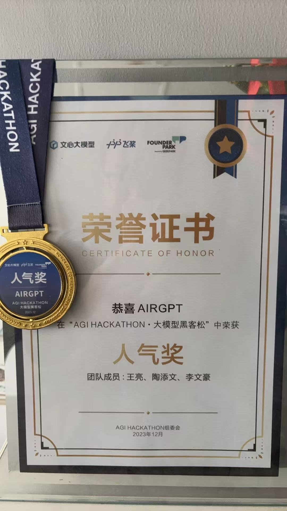

# 课程介绍

## 1 概要

让无人机插上大模型的翅膀，开启AI+无人机开发新范式

自然语言大模型正在重塑自动化控制领域。本课程以AirSim仿真平台为载体，结合视觉大模型、GPT决策模型和多模态技术，构建"感知-决策-控制"全链路无人机智能系统。覆盖从基础控制到复杂任务的全流程开发，代码100%开源，案例可直接部署至真实无人机。

为何需要这门课程？

无人机控制正在从传统智能控制转向大模型驱动的智能决策

2024年GPT-4o、deepseek等多模态模型突破，为无人机提供"视觉+语言"联合推理能力

AirSim作为微软开源的无人机仿真平台，是大模型训练的最佳试验场

我们结合无人机+大模型相关的最新论文，做了这样一个课程，基本覆盖了基于提示词的，agent的，多agent，多模态识别等几个主要的无人机大模型应用方向，可以作为无人机大模型入门学习课程。


本课程作为一个领域入门课程，以仿真为主,后续会另外设置专门的硬件部署课程。


## 2 课程特色

以简单为主，实用为主，让大家学后即用，学习实战，科研入门，皆可：

简单清晰：统一使用Python接口，AirSim API封装为易用类

实用为主：每个功能模块提供最小可运行实例

案例丰富：从提示词应用到多模态大模型在无人机中的应用


本教程面向人群：

1 计算机、电子、控制、无人机等领域科研人员、学生等。

2 无人领域，无人机、机器人等大模型学习入门。最佳的无人机器人大模型学习，具身智能应用

## 3 课程大纲

第一章 AirSim基础开发环境

1.1 开发环境搭建

1.2 AirSim仿真系统搭建

1.3 AirSim 无人机基本控制

1.4 AirSim 无人机视觉感知

1.5 Airsim 多无人机控制


第二章 基于提示词的无人机基础控制

2.1 无人机sdk封装

2.2 OpenAI等SDK调用

2.3 大模型提示词工程入门

2.4 基本飞行控制-飞到汽车上

2.5 复杂指令-检测风力发电机

2.6 完整任务-检测太阳能发电矩阵


第三章 多模态视觉应用

3.1 图片认知大模型简介和使用

3.2 基于感知的自主飞行-发现好喝的

3.3 目标检测大模型简介和应用

3.4 基于感知的自主飞行-寻找小鸭子


第四章 Agent框架应用

4.1 大模型Agent简介

4.2 Smolagents 基本使用

4.3 基于Agent框架自主飞进屋内

4.4 airsim双摄像头定位

4.5 基于Agent的自主屋内搜索


第五章 智能人机交互协同

5.1 语音识别大模型基本应用

5.2 基于语音控制的无人机飞行（上传语音文件）

5.3 gradio简介

5.4 人机协同楼内搜索例子（gradio输入语音）


第六章 多Agent协同

6.1 多Agent系统简介

6.2 多Agent仿真环境搭建

6.3 集中式协同 (Centralized)

6.4 分布式协同 (Distributed)

6.5 CrewAI框架简介与AirSim集成

6.6 分层协同 (Hierarchical)


第七章 视觉语言导航 (VLN)

7.1 无人机VLN概要

7.2 openVLA简介

7.3 AirSim VLN 数据采集与探索

7.4 模型架构、微调与推理

7.5 评估


第八章 世界模型 (World Model)

8.1 世界模型简介

8.2 DreamerV3 深入解析

8.3 悬停 / 避障实验

8.4 从零训练 (Hover / Avoidance)


上面就是课程的全部内容，会动态更新，根据大家反馈不断改进，力争打造一个“无人+大模型"的入门级精品课程。


## 4 项目结构

```
airsim_agent/
├── 0-intro.ipynb          课程导引
├── 1-airsim_basic/        第一章 AirSim 基础环境与控制
├── 2-prompt_app/          第二章 基于提示词的飞行控制
├── 3-mulitmode_app/       第三章 多模态视觉应用
├── 4-agent_app/           第四章 Agent 框架应用
├── 5-user_app/            第五章 语音 / 人机交互协同
├── 6-multi_agent/         第六章 多 Agent 协同 (含 CrewAI)
├── 7-done-VLN/            第七章 视觉语言导航 (VLN)
├── 8-world_model/         第八章 世界模型 (DreamerV3)
├── ernie_airsim/          文心一言 + AirSim 示例
├── rflysim/               RflySim 仿真平台适配
├── external-libraries/    内置 airsim SDK 及依赖 (tornado4/msgpackrpc)
├── img/ prompts/ system_prompts/   公共资源
└── requirements.txt       Python 依赖
```

每个章节目录内均自带 `airsim_wrapper.py` / `airsim_agent.py` 封装与 `settings.json` 仿真配置，可独立运行。

## 5 快速开始

1. 安装依赖：

   ```bash
   pip install -r requirements.txt
   ```

   AirSim Python SDK 已内置于 `external-libraries/`，无需单独安装。

2. 配置 AirSim：将对应章节的 `settings.json` 复制到 `~/Documents/AirSim/`，启动 AirSim 仿真后再运行 notebook。

3. 配置大模型 API Key：使用 OpenAI / 通义千问(DashScope) 等接口时，将密钥设置为环境变量或填入对应 notebook（请勿提交真实密钥到仓库）。

4. 按章节顺序运行 notebook 即可。建议从 `0-intro.ipynb` 开始。


## 课程获奖

因为无人机+大模型相对比较新颖，使用课程参加一些大模型的比赛啥， 一般都能得个奖项。


